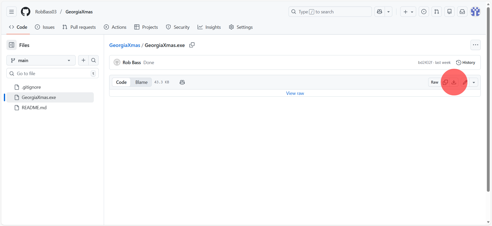
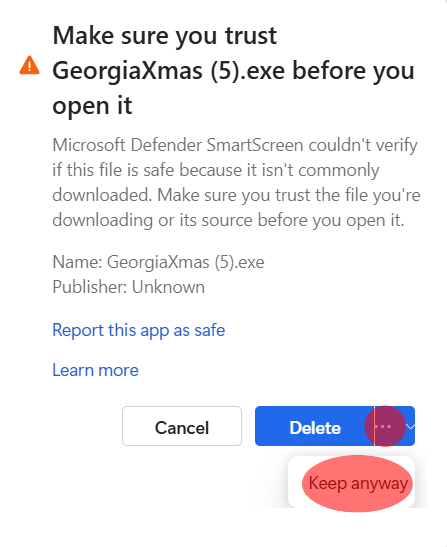

# GeorgiaXmas

To find your christmas present:

-   Click on GeorgiaXmas.exe
-   Download the raw file (just click on the download button on the top right of the box in the centre of the screen, see image below:)

-   If your computer doesn't want to download the files, find buttons that say 'Keep', and keep pressing them. Some are shown below:

-   Run the file
-   When Windows refuses to run it, click on the more info button (This didn't pop up when I was grabbing screenshots, but is fairly straightforward).
-   Then click on 'Run Anyway'
-   Enjoy

The reason your computer is so opposed to downloading/running this file, is cos it's a .exe file. If I was mean, I could do all sorts of awful hacky stuff to you, by getting you to run a random .exe file, so your computer is quite right to be skeptical. However, the file was written by me, and only uses very common, open-source, libraries, so I'd be willing to bet the cost of your computer (about 12 bucks and a firm handshake), that running this file will cause no issues to your computer. I could not say the same for any other random .exe files though, so listen to your computer in every other case.
